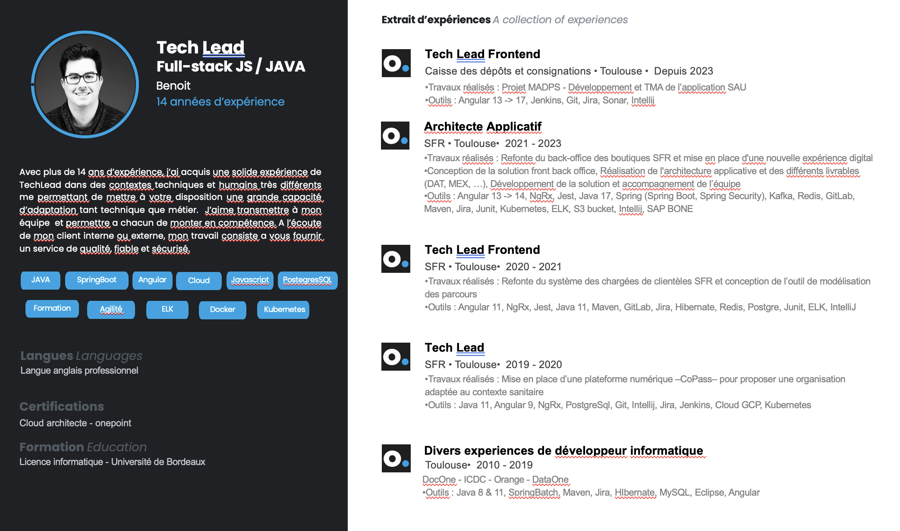

# Feature Specification: Experience Pro

**Feature Branch**: `PBF-21-experience-pro`
**Created**: 2025-12-19
**Status**: Draft
**Input**: User description: "reprend un peu ce au'il y a sur l'image de mon cv pour la partie experience pro. Fait quelque chose de cohérent. adapte aussi les competences car sur les delais cela ne va pas ce qu'il y a aujourd'hui puis y en a trop fait trop grossier"

## Reference Document

**Experience data from CV (14 years total):**
- Tech Lead Frontend @ Caisse des dépôts et consignations, Toulouse (2023 - Présent)
- Architecte Applicatif @ SFR, Toulouse (2021 - 2023)
- Tech Lead Frontend @ SFR, Toulouse (2020 - 2021)
- Tech Lead @ SFR, Toulouse (2019 - 2020)
- Diverses expériences développeur informatique @ Toulouse (2010 - 2019): DocOne, ICDC, Orange, DataOne

## Auto-Resolved Decisions *(mandatory when clarification policies apply)*

- **Decision**: Scope limited to Experience section and Skills data update (not full CV redesign)
- **Policy Applied**: AUTO → CONSERVATIVE (fallback due to low confidence)
- **Confidence**: Low (absScore=1, netScore=-1)
- **Fallback Triggered?**: Yes — insufficient context signals to confidently select PRAGMATIC
- **Trade-offs**:
  1. Scope: Adding a dedicated Experience section requires new component creation
  2. Quality: Full alignment with CV data ensures accuracy and coherence
- **Reviewer Notes**: Validate experience dates and job titles against current CV before implementation

---

- **Decision**: Create a new "Experience" section rather than integrating into existing About section
- **Policy Applied**: CONSERVATIVE
- **Confidence**: Medium — CV shows dedicated "Extrait d'expériences" section separate from profile
- **Fallback Triggered?**: No
- **Trade-offs**:
  1. Scope: New section requires navigation updates (6th section or replace existing)
  2. UX: Dedicated section provides clearer information architecture
- **Reviewer Notes**: Confirm if Experience should be a 6th section or replace/integrate with existing section

---

- **Decision**: Reduce skills list by filtering to proficiencyLevel >= 2 and update yearsExperience based on CV (14 years total experience)
- **Policy Applied**: CONSERVATIVE
- **Confidence**: High — CV explicitly shows core skills and user mentions "y en a trop"
- **Fallback Triggered?**: No
- **Trade-offs**:
  1. Scope: Removing low-proficiency skills simplifies UI
  2. Data: Years need recalculation based on 2010 start date (15 years as of 2025)
- **Reviewer Notes**: Review final skills list against CV badges (JAVA, SpringBoot, Angular, Cloud, JavaScript, PostgreSQL, Agilité, ELK, Docker, Kubernetes)

## User Scenarios & Testing *(mandatory)*

### User Story 1 - View Professional Experience Timeline (Priority: P1)

A visitor views the portfolio to understand the candidate's professional background and career progression. They see a chronological timeline of positions with company names, roles, dates, and key responsibilities.

**Why this priority**: Core value proposition - visitors need to quickly assess professional experience before considering contact.

**Independent Test**: Can be fully tested by navigating to the Experience section and verifying all positions are displayed with correct data (dates, companies, roles, descriptions).

**Acceptance Scenarios**:

1. **Given** a visitor on the portfolio homepage, **When** they navigate to the Experience section, **Then** they see a timeline of professional experiences ordered from most recent to oldest
2. **Given** a visitor viewing the Experience section, **When** they hover/focus on an experience entry, **Then** they see additional details about the role (responsibilities, technologies used)
3. **Given** a visitor on a mobile device, **When** they view the Experience section, **Then** the timeline adapts to a stacked vertical layout that remains readable

---

### User Story 2 - Review Updated Skills Matrix (Priority: P2)

A visitor explores the candidate's technical skills to assess fit for a project or position. They see a refined list of core competencies with accurate experience durations.

**Why this priority**: Skills complement experience but are secondary to understanding career history.

**Independent Test**: Can be tested by navigating to the Expertise section and verifying skills display correct years of experience calculated from 2010 start date.

**Acceptance Scenarios**:

1. **Given** a visitor viewing the Expertise section, **When** they scan the skills matrix, **Then** they see only core skills (proficiency >= 2) without excessive low-relevance entries
2. **Given** a visitor reviewing a skill, **When** they check the years of experience, **Then** the duration reflects actual usage period (e.g., Angular shows ~10 years from 2014 start)
3. **Given** the current date of 2025, **When** skills are displayed, **Then** years of experience are calculated correctly (total 15 years in industry since 2010)

---

### User Story 3 - Navigate Between Experience and Skills (Priority: P3)

A visitor can seamlessly navigate between experience history and skills matrix to correlate positions with acquired competencies.

**Why this priority**: Navigation enhances UX but core content delivery is more important.

**Independent Test**: Can be tested by clicking navigation links between Experience and Expertise sections and verifying smooth scroll behavior.

**Acceptance Scenarios**:

1. **Given** a visitor on the Experience section, **When** they click on a technology tag, **Then** the page scrolls to the related skill in the Expertise section (or highlights it)
2. **Given** a visitor using keyboard navigation, **When** they tab through Experience entries, **Then** focus states are visible and navigation follows logical order

---

### Edge Cases

- What happens when an experience entry has no technologies listed? Display entry without technology tags section
- How does system handle experiences with ongoing dates (e.g., "Depuis 2023")? Display as "2023 - Présent"
- What if skills.json contains skills with 0 yearsExperience? Filter them out from display

## Requirements *(mandatory)*

### Functional Requirements

- **FR-001**: System MUST display professional experience entries in reverse chronological order (most recent first)
- **FR-002**: System MUST show for each experience: job title, company name, location, date range, and description
- **FR-003**: System MUST display technology tags/badges associated with each experience
- **FR-004**: System MUST update skills.json with corrected years of experience based on actual usage periods
- **FR-005**: System MUST filter displayed skills to those with proficiencyLevel >= 2
- **FR-006**: System MUST recalculate yearsExperience values to be coherent with a 2010 career start date
- **FR-007**: System MUST support responsive layout for experience timeline (desktop and mobile)
- **FR-008**: System MUST respect prefers-reduced-motion for any timeline animations
- **FR-009**: System MUST maintain keyboard accessibility for all interactive elements
- **FR-010**: System MUST use existing color palette tokens (--color-primary, --color-secondary, --color-text)

### Key Entities *(include if feature involves data)*

- **Experience**: Represents a professional position with attributes: id, role, company, location, startDate, endDate (optional for current), description, technologies (array of skill IDs)
- **Skill** (existing): Technical competency with proficiencyLevel and yearsExperience - yearsExperience to be updated based on CV data

## Success Criteria *(mandatory)*

### Measurable Outcomes

- **SC-001**: 100% of professional experiences from CV are accurately displayed in the Experience section
- **SC-002**: Skills list reduced by at least 40% (filtering proficiencyLevel < 2)
- **SC-003**: All experience entries are visible and readable on screens from 320px to 1920px width
- **SC-004**: 100% of interactive elements (links, buttons, expandable items) are keyboard accessible
- **SC-005**: Experience section loads and displays content within 2 seconds on standard connections
- **SC-006**: WCAG 2.1 AA contrast compliance maintained across all new UI elements
