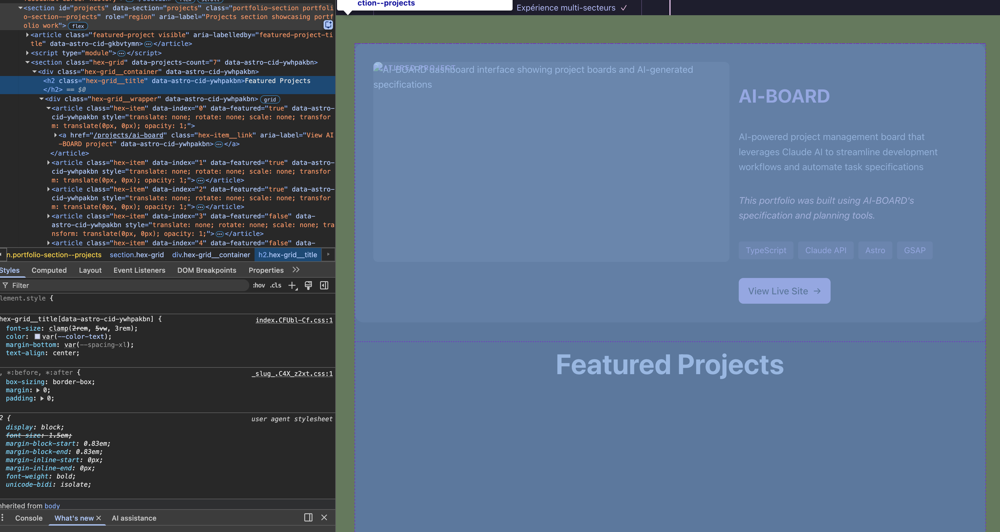

# Feature Specification: Featured Project Layout and Image Fix

**Feature Branch**: `PBF-27-featured-project-issue`
**Created**: 2025-12-19
**Status**: Draft
**Input**: User description: "regarde le screen, le bloc du featured project ai-board est avant le titre puis l'image ne fonctionne pas"

## Auto-Resolved Decisions

- **Decision**: Scope limited to fixing existing bugs (layout ordering + broken image) rather than adding new features
- **Policy Applied**: AUTO (resolved as PRAGMATIC - bug fix context)
- **Confidence**: High (0.9) - Clear bug report with visual evidence, no ambiguity in expected behavior
- **Fallback Triggered?**: No
- **Trade-offs**:
  1. Minimal scope keeps changes focused and low-risk
  2. Quick turnaround for user-facing issue
- **Reviewer Notes**: Verify fix on all breakpoints (mobile/tablet/desktop) before deployment

---

- **Decision**: Image fix approach - replace placeholder with actual screenshot or use a fallback design
- **Policy Applied**: AUTO (resolved as PRAGMATIC)
- **Confidence**: High (0.9) - Image file exists but is a 570-byte placeholder; needs real content or graceful fallback
- **Fallback Triggered?**: No
- **Trade-offs**:
  1. Real screenshot provides better UX but requires asset creation
  2. CSS fallback is faster to implement but less visually appealing
- **Reviewer Notes**: Confirm final image asset is provided or approve CSS gradient fallback approach

## Problem Analysis

Based on the screenshot provided, two issues are identified:

### Issue 1: Layout Ordering (Mobile)
The FeaturedProject component block appears **before** the "Featured Projects" section title (`h2.hex-grid__title`). On mobile view:
- Current order: FeaturedProject block → "Featured Projects" h2 title → ProjectsHexGrid
- Expected order: "Featured Projects" h2 title → FeaturedProject block → ProjectsHexGrid

The issue is that `FeaturedProject.astro` is a standalone component placed inside the Projects section, but the section title "Featured Projects" comes from `ProjectsHexGrid.astro`. This creates incorrect visual hierarchy on mobile.

### Issue 2: Broken Image
The AI-BOARD project image at `/images/projects/ai-board.webp` displays as broken (showing alt text instead of image). The file exists but is only 570 bytes - indicating it's a placeholder file, not a real image.

## User Scenarios & Testing

### User Story 1 - View Featured Project Section (Priority: P1)

A visitor views the Projects section and sees the AI-BOARD featured project prominently displayed with correct visual hierarchy: section title first, then the featured project card with a working image.

**Why this priority**: Core functionality - the featured project is the primary showcase item and must display correctly to communicate professional quality.

**Independent Test**: Navigate to `/#projects` section and verify the section title appears before the featured project card, and the image renders correctly.

**Acceptance Scenarios**:

1. **Given** a visitor on the homepage, **When** they scroll to the Projects section, **Then** they see "Featured Projects" (or equivalent section title) displayed above the AI-BOARD featured project card
2. **Given** a visitor viewing the Projects section on mobile (≤767px), **When** the page loads, **Then** the section title appears first, followed by the featured project card in stacked layout
3. **Given** a visitor viewing the Projects section, **When** the featured project card is visible, **Then** the AI-BOARD image displays correctly (not broken/alt text)

---

### User Story 2 - Responsive Layout Consistency (Priority: P2)

A visitor views the Projects section on different devices (mobile, tablet, desktop) and sees consistent, logical ordering of elements across all breakpoints.

**Why this priority**: Ensures professional appearance across all devices, affecting user perception of quality.

**Independent Test**: Test the Projects section at viewport widths of 320px, 768px, and 1440px and verify layout consistency.

**Acceptance Scenarios**:

1. **Given** a visitor on a mobile device (≤767px), **When** viewing the Projects section, **Then** elements appear in logical order: section title → featured project → other projects
2. **Given** a visitor on a tablet (768px-1023px), **When** viewing the Projects section, **Then** the featured project layout displays side-by-side with proper image rendering
3. **Given** a visitor on desktop (≥1024px), **When** viewing the Projects section, **Then** the featured project displays with 60/40 image/content split with working image

---

### Edge Cases

- What happens when the image file is missing or fails to load? → Display a styled fallback (gradient or placeholder)
- What happens when AI-BOARD project entry is missing from content collection? → The component already handles this with conditional rendering (`{aiBoard && (...)}`)
- How does the layout behave at intermediate viewport sizes? → CSS media queries should provide smooth transitions

## Requirements

### Functional Requirements

- **FR-001**: System MUST display the Projects section title before the FeaturedProject component in visual order on all viewport sizes
- **FR-002**: System MUST display a valid image for the AI-BOARD featured project (either real screenshot or styled fallback)
- **FR-003**: System MUST maintain consistent visual hierarchy across mobile (≤767px), tablet (768-1023px), and desktop (≥1024px) breakpoints
- **FR-004**: System MUST provide a graceful fallback when project image fails to load
- **FR-005**: System MUST preserve existing accessibility features (aria-labels, semantic HTML, alt text)

### Key Entities

- **FeaturedProject**: Component displaying the AI-BOARD showcase card with image, title, description, technologies, and CTA
- **ProjectsHexGrid**: Component displaying the grid of other projects with section title "Featured Projects"
- **Project Content Entry**: Markdown file in `src/content/projects/` defining project metadata including image path

## Success Criteria

### Measurable Outcomes

- **SC-001**: Section title "Featured Projects" (or equivalent) appears visually before the AI-BOARD card on 100% of viewport sizes
- **SC-002**: AI-BOARD project image renders correctly (no broken image icon or alt text fallback visible) on all supported browsers
- **SC-003**: Lighthouse accessibility score remains at or above current baseline after changes
- **SC-004**: No layout shift (CLS) caused by image loading in the featured project section

## Assumptions

- A real AI-BOARD screenshot image will be provided, OR a CSS gradient/placeholder fallback is acceptable
- The "Featured Projects" section title should be part of or controlled by the Projects section wrapper, not embedded in ProjectsHexGrid
- No changes to the FeaturedProject component's internal layout (image/content split) are required
