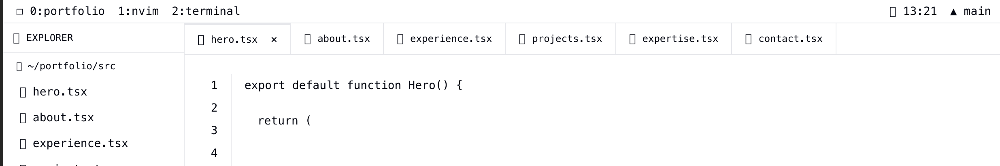

# Feature Specification: TUI Layout Redesign

**Feature Branch**: `PBF-37-layout-tui`
**Created**: 2025-12-20
**Status**: Draft
**Input**: User description: "Layout TUI - Il faudrait revoir la disposition pour reprendre ce que j'ai mis sur la maquete. Les tabs du haut ne font pas assez tab. Il faudrait aussi revoir le scroll, sur mobile ne me gene pas mais sur pc il faudrait que cela switch de tab donc plutot une animation de gauche a droite pour simuler le deplacement entre les onglet. Les numero de ligne dont par fichier/tab."

## Visual Reference

*Mockup showing desired Neovim buffer tab aesthetic with file icons, clear tab borders, and proper spacing*

## Auto-Resolved Decisions

### Decision 1: Tab Visual Styling Approach

- **Decision**: Adopt the mockup's tab styling with clear visual separation (background, borders, and file icons) matching the Neovim buffer tab aesthetic
- **Policy Applied**: CONSERVATIVE (fallback from AUTO)
- **Confidence**: Medium (0.6) - mockup image provides clear visual reference
- **Fallback Triggered?**: Yes - AUTO policy had low confidence (0.3) due to neutral feature context, promoted to CONSERVATIVE
- **Trade-offs**:
  1. Requires CSS changes to BufferTab component but preserves existing component architecture
  2. Visual consistency with mockup ensures user expectations are met
- **Reviewer Notes**: Validate that the tab styling matches the mockup's visual density (borders, spacing, icon placement)

### Decision 2: Desktop Scroll Behavior - Horizontal Tab Animation

- **Decision**: On desktop, implement horizontal slide animation between sections instead of vertical scroll, creating the illusion of switching between editor tabs
- **Policy Applied**: CONSERVATIVE (fallback from AUTO)
- **Confidence**: Medium (0.6) - user explicitly requested "animation de gauche a droite pour simuler le deplacement entre les onglet"
- **Fallback Triggered?**: Yes
- **Trade-offs**:
  1. Requires significant changes to navigation system (from vertical scroll to horizontal slide)
  2. All sections must be rendered in DOM for smooth transitions (increased initial load)
  3. Better UX matches real IDE tab-switching behavior
- **Reviewer Notes**: Performance impact should be tested on lower-tier devices; ensure fallback to simple transitions if performance degrades

### Decision 3: Mobile Behavior Unchanged

- **Decision**: Keep current vertical scroll behavior on mobile devices (user stated "sur mobile ne me gene pas")
- **Policy Applied**: CONSERVATIVE
- **Confidence**: High (0.9) - explicit user statement
- **Fallback Triggered?**: No
- **Trade-offs**:
  1. No development effort for mobile scroll changes
  2. Different UX between mobile and desktop (intentional per user preference)
- **Reviewer Notes**: Document the intentional behavior difference in user-facing documentation

### Decision 4: Per-Section Line Numbers

- **Decision**: Line numbers reset to 1 for each section/tab, simulating individual file editing
- **Policy Applied**: CONSERVATIVE
- **Confidence**: High (0.9) - user explicitly stated "Les numero de ligne dont par fichier/tab"
- **Fallback Triggered?**: No
- **Trade-offs**:
  1. Requires tracking section-specific line counts
  2. More authentic IDE experience
- **Reviewer Notes**: Line count should reflect actual visible content lines or be decorative with reasonable count per section

## User Scenarios & Testing

### User Story 1 - Desktop Tab Navigation (Priority: P1)

A developer visits the portfolio on desktop and navigates between sections using the top buffer tabs. When clicking a tab, the content area smoothly slides horizontally to reveal the selected section, mimicking the experience of switching between open files in a code editor.

**Why this priority**: Core user experience improvement requested by stakeholder - transforms the portfolio from a scrolling page to an authentic IDE-like tab interface

**Independent Test**: Can be fully tested by clicking each buffer tab and observing horizontal slide animation; delivers the primary UX value of tab-switching simulation

**Acceptance Scenarios**:

1. **Given** user is viewing the Hero section on desktop, **When** user clicks the "about.tsx" tab, **Then** content slides horizontally from right to left revealing the About section
2. **Given** user is viewing the Experience section, **When** user clicks the "hero.tsx" tab, **Then** content slides horizontally from left to right (reverse direction) to reveal Hero
3. **Given** user is on any section, **When** user presses keyboard navigation (j/k or arrow keys), **Then** content slides to adjacent section with appropriate direction

---

### User Story 2 - Authentic Buffer Tab Styling (Priority: P1)

Users see buffer tabs that look like real Neovim/tmux tabs with clear visual distinction between active and inactive states, file icons, and proper spacing as shown in the mockup.

**Why this priority**: Visual authenticity is essential for the TUI aesthetic - current tabs "ne font pas assez tab"

**Independent Test**: Visual inspection of tab bar matches mockup reference; active tab clearly distinguishable from inactive tabs

**Acceptance Scenarios**:

1. **Given** the portfolio loads, **When** user views the top bar, **Then** tabs display with file icons, clear borders/separators, and proper Neovim aesthetic
2. **Given** user hovers over an inactive tab, **When** hover state activates, **Then** tab shows visual feedback distinct from default and active states
3. **Given** "hero.tsx" is the active section, **When** user views the tab bar, **Then** the hero tab has distinct active styling (background, text color) and close indicator (x)

---

### User Story 3 - Per-Section Line Numbers (Priority: P2)

Each section displays its own line numbers starting from 1, simulating individual file buffers rather than one continuous document.

**Why this priority**: Enhances authenticity of the "file per section" metaphor but secondary to navigation and visual improvements

**Independent Test**: Navigate to each section and verify line numbers start at 1 and reflect the section's content

**Acceptance Scenarios**:

1. **Given** user navigates to the About section, **When** the section is displayed, **Then** line numbers start at 1 (not continuing from previous section)
2. **Given** user switches between Hero and Contact sections, **When** comparing line numbers, **Then** each section has independent line numbering starting at 1
3. **Given** a section has specific content length, **When** viewing line numbers, **Then** the count is appropriate for that section's content

---

### User Story 4 - Mobile Scroll Preservation (Priority: P2)

On mobile devices, users continue to experience smooth vertical scrolling between sections, preserving the current behavior that works well on smaller screens.

**Why this priority**: User explicitly approved mobile behavior - no changes needed, but must verify no regression

**Independent Test**: Access portfolio on mobile device or emulator and verify smooth vertical scrolling remains functional

**Acceptance Scenarios**:

1. **Given** user accesses portfolio on mobile device (< 768px), **When** user scrolls vertically, **Then** sections scroll naturally with current smooth scroll behavior
2. **Given** user on mobile taps a tab, **When** navigation occurs, **Then** page scrolls vertically to the section (not horizontal slide)

---

### Edge Cases

- What happens when user rapidly clicks multiple tabs? Animation should queue or cancel current animation and start new one
- How does system handle browser back/forward navigation with horizontal slide? Should slide in appropriate direction based on history
- What happens during transition if user starts another navigation? Cancel current animation gracefully, start new
- How does reduced motion preference affect horizontal slide? Fallback to instant switch without animation
- What happens on viewport resize between mobile/desktop during animation? Complete current animation, apply new behavior on next navigation

## Requirements

### Functional Requirements

- **FR-001**: System MUST display buffer tabs with visual styling matching the mockup (file icons, borders, clear active/inactive states)
- **FR-002**: System MUST animate horizontal slide transitions between sections on desktop viewport (>= 1024px)
- **FR-003**: System MUST preserve vertical scroll navigation on mobile viewport (< 1024px)
- **FR-004**: System MUST reset line numbers to 1 for each section/tab
- **FR-005**: System MUST handle browser back/forward navigation with appropriate slide direction
- **FR-006**: System MUST support keyboard navigation (j/k, arrow keys) with horizontal slide on desktop
- **FR-007**: System MUST respect prefers-reduced-motion preference by disabling/reducing animations
- **FR-008**: System MUST queue or cancel animations appropriately during rapid tab switches
- **FR-009**: System MUST update URL hash to reflect active section for deep linking
- **FR-010**: System MUST synchronize active state across tabs, sidebar files, and statusline

### Key Entities

- **Section/Buffer**: Represents a full-viewport content area corresponding to a single "file" tab (Hero, About, Experience, Projects, Expertise, Contact)
- **BufferTab**: Visual tab element in the top bar representing a section, with icon, label, window number, and active state
- **LineNumbers**: Decorative gutter element with per-section numbering starting at 1
- **NavigationState**: Current active section, animation state, and viewport mode (desktop/mobile)

## Success Criteria

### Measurable Outcomes

- **SC-001**: Users can visually distinguish active tab from inactive tabs at a glance without confusion
- **SC-002**: Desktop tab switch animation completes within 400ms for smooth perception
- **SC-003**: Navigation between any two sections requires only one click/keypress
- **SC-004**: Line numbers correctly reset to 1 when switching to any section
- **SC-005**: Mobile scroll behavior shows no regression from current implementation
- **SC-006**: Portfolio maintains 60fps during tab switch animations on high-tier devices
- **SC-007**: Users with reduced motion preference experience no jarring animations
- **SC-008**: Browser back/forward correctly navigates section history with appropriate visual feedback
